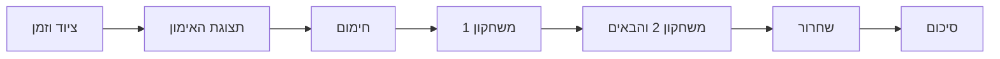

# איפיון תיקון מלא — אימון עם חימום, משחקונים ושחרור

**המשך מחייב לאיפיון:** [טבלת v8 ופרומפט 09](FITNESS-GAMES-TABLE-2026-10-08.md) מחדדים את מסע N19: שני סוגי אימון, תחנות מרובות תרגילים, דוגמאות נפרדות וחוזה ממשק ושעון מפורש. בעת מימוש השתמש בנוסחי v8 במקום נוסח מסך סותר במסמך זה. המימוש עדיין N18.


7.10.2026 · N19 / [T029](../work/tasks/T029.md) · בעלים: Codex.

**מצב: איפיון תיקון שנדרש בעקבות משוב הבעלים; טרם מומש וטרם נפרס.** ההתנהגות הנוכחית מתועדת ב[ביקורת ובצילומי הדפדפן](../audits/workout-journey-ux-2026-10-07/README.md). מסמך זה קובע את מסע המשתמש הנדרש; אין לקרוא אותו כתיאור יכולת שכבר קיימת.

## 1. הבעיה והחלטת המוצר

המוצר הנוכחי מחבר משחק יחיד לאימון שלם. הוא אינו מספק התחלה בחימום, רצף משחקונים וסיום בשחרור. ״הכנה לתנועה״ מופיעה לאחר בחירת שער ומצריכה אותו מחזור בחירה ודיווח; ״סיים עכשיו״ סוגר את האימון; בחירת משחק אחר מהפתיחה עלולה להידחות משום שבדיקת ההתאמה כלל לא נטענה. רוב המלל הראשון מסביר סיפור ומדיניות במקום מה לעשות בגוף.

היחידה שהמשתמש מתחיל ומסיים תהיה **אימון אחד**:

**בחירת ציוד וזמן → תצוגת האימון → חימום → משחקון 1 → משחקון 2 → משחקונים נוספים לפי המסלול → שחרור → סיכום.**



המסלול הרגיל מכיל לפחות שני משחקונים; המערכת מציעה שלושה כשאפשר לתת להם מקום אמיתי במסגרת. אלה יעדי עיצוב למבנה, לא מכסת עבודה, מרשם חזרות או סף מקצועי. המספר נבחר לפני ההתחלה ומוצג; סדר ומספר יכולים להשתנות במפורש בעקבות ציוד, מגבלה, רצון המשתמש או יתרת זמן. אין התחייבות לניצחון בכל משחקון ואין עבודה משלימה כדי למלא את הזמן.

אימון קצר שבו שני משחקונים אינם נכנסים עם חימום, מנוחות ושחרור לא יתחזה למסלול רגיל: יוצעו הארכת הזמן או ״אימון מקוצר: חימום, משחקון אחד ושחרור״. ההתחלה המקוצרת היא בחירה גלויה. סיום מוקדם של אימון רגיל נשמר כחלקי גם אם בוצע בו משחקון אחד בלבד.

מנוע היכולת והמנוע המשחקי של N18 נשארים הבסיס. נוסף מנהל מסע האימון שמחבר ביניהם. הוא אינו בונה מכסת סטים עתידית, אינו מתכנן עומסים מראש ואינו מחזיר את הבונה הישן. לכל פעולה גופנית נדרש האישור המקצועי הקיים ומקור הרישום נשאר SetLog.

## 2. מה המשתמש צריך להבין בכל רגע

בכל מסך אימון אפשר לענות בלי לפתוח תפריט:

1. באיזה שלב אני: חימום, איזה משחקון, מנוחה או שחרור?
2. מה לעשות עכשיו בגוף: תרגיל, ציוד, כמות או משך, עומס אם רלוונטי, ואיך לבצע?
3. מה הפעולה הזאת משנה במשחקון, ומה מסיים אותו?
4. מה הכפתור הראשי יעשה, ומה יופיע אחריו?

כותרת האימון היא ״האימון שלי״ בעברית ו־My workout באנגלית. ״משחקון״ מציין פרק באימון; ״פעולה״ מציינת ביצוע גופני מאושר; ״סיימתי את התרגיל״ פותח דיווח; ״המשך למשחקון הבא״ עובר לפרק הבא; ״סיים את האימון״ מסיים את המסע דרך מסלול הסיום. המילים האלה אינן מתחלפות זו בזו.

## 3. תחילת אימון והתאמה לציוד

מסך הפתיחה מציג ״איפה מתאמנים?״, ״מה זמין?״ ו״כמה זמן יש לך?״ לצד הבחירות השמורות. משתמש חוזר מאשר אותן בלחיצה אחת; משתמש חדש אינו נשלח בשקט לחדר כושר של 45 דקות. הכפתור ״שנה ציוד וזמן״ גלוי בפתיחה ובתצוגת האימון, גם כשהמסלול החדש פעיל.

ציוד מוצג בשמות מוכרים ובקבוצות קצרות: ללא ציוד, משקולות יד, גומייה, ומכשירים זמינים בחדר כושר. מאפיינים נוספים נפתחים לפי הבחירה בלבד. אפשר לסמן ציוד תפוס או חסר. משקולות נרשמות פעם אחת עם ״לכל יד״ או ״סך הכול״; מכשיר שנדרש לזהותו מקבל שם מקומי כמו ״מכשיר החתירה שלי״. אין חובה להמציא מזהה טכני ואין רשימת עומסים בפסיקים בשימוש הרגיל. פרטים נחוצים למנוע נשמרים מאחורי בקר מתאים, עם יחידות מפורשות ובלי להסיק ציוד שאינו ידוע.

הצעת המסלול מתבצעת כך:

1. סינון לפי ציוד זמין, מקום, מגבלות, מיומנות ותחום מקצועי נתמך.
2. בדיקת פעולות אפשריות לכל משחקון באמצעות אותו resolver/evaluator ומצב הגוף העדכני.
3. בחירת פרקים שאפשר לשלב בזמן, לרבות חימום, הכנות נחוצות, מנוחות, מעברים ושחרור.
4. דירוג לפי העדפות מפורשות, התאמה לציוד, גיוון תנועות וחפיפה מהעבודה האחרונה. חזרתיות וסיפור אינם גוברים על מגבלות הגוף.
5. הצגת מסלול מוצע קצר. ״החלף משחקון״ מציע רק חלופות שנבדקו לאותו מקום במסלול.

בחירת משקולות אינה מחייבת שימוש בהן בכל תרגיל; ההצעה מסבירה כאשר בחרה תנועת משקל גוף. עם ציוד נוסף צריך להיות הבדל מוצדק בהצעה או הסבר ברור למה לא נעשה בו שימוש. אין ״20 משחקים מתאימים״ על סמך האפשרות לבצע פעולה יחידה בלי לבדוק שהפרק ניתן להתחלה וסיום בתחום הזמן.

כאשר אין חלופה, מוצגים סיבה מעשית ודרך פעולה: ״למשחקון הזה צריך גומייה. בחר משחקון ללא ציוד״; ״נשאר זמן לשחרור בלבד״. מצב בדיקה חסר הוא ״בודקים התאמה…״, ושגיאת רשת היא ״לא הצלחנו לבדוק. נסה שוב״. אף אחד מהם אינו מתורגם ל״לא מתאים״.

## 4. תצוגת האימון לפני התחלה

התצוגה מציגה קודם את המבנה, למשל:

> האימון שלך · בבית · ללא ציוד · עד 30 דקות
>
> חימום → 3 משחקונים → שחרור
>
> המשחקונים: פותחים את הדרך, צמד מנצח, המסירה הבאה.
>
> בכל פעם נציג תרגיל אחד. אפשר לסיים מוקדם.
>
> **מתחילים בחימום**

זהו דגם נוסח; שלוש הדוגמאות אינן מסלול מקצועי קשיח. אומדן הזמן כולל מנוחה והסברים ואינו מציג את תקרת הזמן כזמן תנועה. אם אי אפשר לחשב אומדן אמין, מופיע ״עד 30 דקות״ בלבד. אין ״אימון של 0 דקות״ ואין מספר תחנות מתוך מערך blocks ריק.

מתחת למבנה אפשר להחליף משחקון ולראות ״למה מתאים לי״. הספרייה היא מסך נפרד עם 20 זהויות, מצב התאמה ומטרה פשוטה לכל אחת. כניסה לספרייה אכן מציגה ספרייה, וכרטיס פותח הסבר משחקון. אין רכיב override שמחליף את הפתיחה, התוכנית, הספרייה ופרטי המשחק באותו תוכן.

## 5. החימום

השלב נקרא **״חימום״** ומופיע ראשון, לפני בחירת שער או מסלול משחקי. הוא מציג פעולת חימום אחת בכל רגע, איך לבצע וכמות/משך שאושרו. מוצגים ״חימום 1 מתוך 2״ או התקדמות מתאימה לתוכן שנבחר, וכפתור ״מתחילים את החימום״. אחרי שמירה מוצגת הפעולה הבאה; בסוף מופיע ״החימום הסתיים — למשחקון הראשון״.

תוכן החימום נבחר לפי התנועות האפשריות, הציוד, המגבלות והעבודה האחרונה. מוגדרים לו מזהה וגרסת תוכן, מטרת הכנה, הוראות ביצוע, תחום התאמה, מנה, תנאי עצירה ומנוחה. הכמות וכל שינוי בה עוברים evaluator שמכיר את השלב. אין שימוש במינון המשחק באופן אוטומטי ואין קביעה שכל חימום מתאים לכל ציוד.

הכנה ספציפית לתרגיל חדש נשארת אפשרית בתוך משחקון, עם הסבר גלוי: ״לפני השימוש במשקולות נעשה הכנה קצרה לתנועה הזאת״. היא אינה חימום כל האימון ואינה פותחת שער. עבודה שכבר בוצעה בחימום יכולה להיחשב הכנה רק כאשר המדיניות המקצועית מאשרת התאמה לאותו variant ולתנאים; שינוי ציוד אינו מעביר כשירות אוטומטית.

חימום לא מסומן כהושלם בגלל לחיצה, חלוף זמן או דילוג. ניתן לצאת מהאימון; אין כפייה לבצע פעולה. מעבר ישיר למשחקים בלי חימום מוצע רק אם המדיניות המקצועית תגדיר ותאשר תנאים לכך; המסירה הראשונה אינה כוללת קיצור דרך כזה.

## 6. כניסה לכל משחקון

כותרת השלב תמיד מלווה את שם המשחק: ״משחקון 2 מתוך 3 — צמד מנצח״. לפני פעולה ראשונה מוצגים שלושה משפטים קצרים:

- **המטרה:** מה מנסים להשיג בפרק הזה.
- **איך משחקים:** בוחרים אפשרות, מבצעים את התרגיל שמוצג ושומרים מה שבוצע; תוצאה תקפה משנה את המשחק.
- **מתי ממשיכים:** בהשגת המטרה או בבחירה לסיים את המשחקון, עוברים לבא; האחרון מוביל לשחרור.

דוגמה ל־G09: ״המטרה: להגיע לאחד המוצאים של האי. בחר שער; נציג את התרגיל שפותח אותו. לאחר ביצוע מלא ושמירה נתקדם לאזור הבא. בסיום נמשיך למשחקון הבא.״ דוגמת פעולה/תגובה קטנה מדגימה את החוק לפני בחירה. הכנה מוצגת כהכנה ולא כביצוע שפותח את השער.

בחירה משחקית נשמרת רק כשהיא מספקת הבדל מובן. לדוגמה: ״מגדל תצפית — נקבל מפה. התרגיל הבא: אופניים באוויר״ מול ״סדנה — נקבל מפתח. התרגיל הבא: [שם התרגיל שנמצא מתאים]״. אין הבטחת תרגיל שאינו תואם לציוד.

## 7. חוזה ההסבר לכל 20 המשחקים

לכל משחקון נכתבים בעברית ובאנגלית מטרה, הוראת בחירה, פעולה/תגובה לדוגמה, התקדמות ותנאי סיום. השורות הבאות מגדירות את משמעות ההסבר; מינון ותרגיל נקבעים בזמן אמת. חוקי התוצאה המדויקים נשארים בחוזי המנוע, עם גרסה, ואינם מחושבים בטקסט.

| משחקון | מה המשתמש בוחר ומבין | מה מסיים את הפרק |
|---|---|---|
| G01 מרדף החזרות | עקבות חושפים את הדרך; קיצור משנה איפה אפשר לפגוש מטרה. ביצוע התרגיל מקדם את המרדף. | תפיסת מטרה באחד המסלולים. |
| G03 המשימה בחלון | משימת חילוץ או סיור; נכתב במפורש שהבחירה סוגרת אפשרות אחרת. | סיום חילוץ או מסירת תגלית. |
| G04 טיפוס לפסגה | מסלול רכס או מחנה תמיכה; מוצג איך הבחירה משנה את הפסגה הזמינה. | הגעה לפסגה של הדרך שנבחרה. |
| G05 טיפוס המשקולות | השקעה בבסיס או בתמיכה בצד; התוצאה מצוירת כמבנה שנוסף לו חלק. | מגדל מאוזן או מחוזק. |
| G06 מורידים הילוך | איזה מטען לשמור; הסבר תועלת החבל והמזון לפני בחירה. | השלמת מעבר בעזרת המטען שנשמר. |
| G08 ממלאים את המד | איזה רכיב לבנות; חלקים מאפשרים מבנים שונים. | השלמת אחד המבנים התקפים. |
| G09 פותחים את הדרך | שער לקבלת מפה או מפתח; מוצג המוצא שנפתח בעקבותיהם. | יציאה מהאי. |
| G10 מחזיקים את הקצב | כיוון המסע וקצב משימה. ״חזרות לדקה״ מקבל דוגמה; זה אינו מהירות הגוף. | הגעה ליעד השיירה. |
| G11 רוכבים על הגלים | גל או מעבר שקט; התחזית והאיזון מוצגים באופן מובן. | נחיתה באחד המסלולים. |
| G12 אל הפסגה ובחזרה | להמשיך לעלות או לפנות חזרה; החזרה היא חלק מהמשחקון. | חזרה מנקודת הפנייה שנבחרה. |
| G14 סיבוב נוסף | לנסות השערה או לקבל מידע; מוצג מה למדנו מכל פעולה. | פתרון החוק בדרך ניסוי או מידע. |
| G16 בתוך הקצב | דפוס וקצב שלבי תנועה; הדגמה מסבירה ירידה/עצירה/עלייה. | פענוח רצף תקף. |
| G17 צמד מנצח | איזה משני חלקים לאסוף; מוצג השילוב האפשרי. | השלמת שילוב שמפיק מפה או כלי. |
| G18 הקפה ועוד הקפה | תחנה שמוסיפה קישור ללוח; מוצג מה התחבר. | יצירת קישור מוצא תקף. |
| G19 הלוך וחזור | חקירה או חזרה; המרחק הוא משאב משחקי עם הוראה גופנית נפרדת. | חזרה בדרך רגילה או בקיצור שנחשף. |
| G21 המשימה והשותף | השקעה במשימה או בתמיכה; מוסבר כיצד תמיכה פותחת סיום אחר. | השלמה ישירה או משותפת. |
| G23 המסירה הבאה | יעד מסירה שמשנה את המשימה הבאה; מוצג למי הגיעה החבילה. | סיום אחת משרשראות המסירה. |
| G24 אוספים זמן | איך להשתמש בבנק המשחקי; כתוב שהבנק אינו מוסיף זמן אימון או מקצר מנוחה. | פתיחת מוצא דרך מידע או גשר. |
| G28 שתי מטרות | איך להשקיע במגדלור ובגינה; התוצאה מוצגת כשינוי באי. | אחד המצבים הסופיים התקפים. |
| G30 סופרים לאחור | הקצאת משאב לדלת או למנהרה. המשאב המשחקי אינו מחייב עוד חזרות. | פתיחת מוצא או תום המשאב המשחקי; גם הפסד מאפשר להמשיך באימון. |

כל פרק מקבל תחום אורך ותנאי סיום מפורשים, כולל סיום חלקי. תקרת תורים משחקית יכולה למנוע פרק אינסופי; היא אינה יעד ביצוע גופני ולא מזכה בניצחון אם החוק לא הושג. אפשר לקצר פרק ולהמשיך בלי לבצע עוד פעולה. אין ״ניצחון״ מלאכותי כדי לעמוד בזמן או מעבר שמפעיל תרגיל חדש אוטומטית.

## 8. מסך הפעולה הגופנית

סדר התוכן:

1. פס שלב קטן: ״חימום ✓ · משחקון 1/3 · שחרור בהמשך״.
2. משפט המטרה הקרובה: ״התרגיל הזה פותח את מגדל התצפית״.
3. כרטיס פעולה ראשי: שם תרגיל, המחשה, הוראות קצרות, ציוד, כמות/משך ועומס עם יחידה.
4. בחירה נחוצה לפעולה, אם יש כזו; הסבר פשוט למה בוחרים.
5. כפתור ראשי אחד לפי המצב.

מפה, משאבים, היסטוריה, גרסאות, טווחי חיזוי לא זמינים והסברי המדיניות נמצאים בפירוט משני. הם אינם קודמים לתרגיל. ״איך מבצעים״ נגיש תמיד; ההנחיה הבסיסית מופיעה בכרטיס גם בלי לפתוח גיליון נוסף. הוראה כללית כמו ״תנועה נשלטת ונוחה״ אינה מספיקה ללימוד תרגיל: נדרשים צעדי הביצוע מתוך קטלוג התרגילים והתאמה לתרגיל שנבחר.

מינון שמוצג הוא הוראה שאושרה, לא כמות שכבר בוצעה. במשקל גוף נכתב ״ללא משקולת״; אין ״עומס: 0 משקל גוף״ ואין צורך לבחור אפס כדי לקבל הוראה. במכשיר או במשקולות נדרשת בחירה מפורשת כשהחוזה דורש אותה. ערכים ידועים מוצגים לבחירה ואישור, בלי להזיז עומס בשקט. עד שלושה סוגי בחירה עצמאיים לפי חוזה N18; פעולת ניווט ודיווח אינם בורר תרגיל או מינון נוסף.

לפני התחלה: ״מתחילים את התרגיל״ מאשר את ההוראה העדכנית ומתחיל מדידה. בזמן תרגיל: ״סיימתי את התרגיל״ עוצר מדידה ומעביר למסך דיווח נפרד. שינוי הוראה מחייב הצגה ואישור מחדש. שם התרגיל וההוראה נשארים נגישים בביצוע; אין צורך לזכור אותם ממסך קודם.

## 9. דיווח ושמירה

מיד לאחר סיום התרגיל מופיע מסך קצר: ״כמה ביצעת?״ עם שתי דרכים ברורות:

- **״ביצעתי את כל ההוראה — [כמות ויחידה]״**: אישור מפורש שהכמות והתנאים שהוצגו אכן בוצעו. שולח דיווח יחיד; אין שמירה לפני לחיצה.
- **״ביצעתי אחרת״**: כמות בפועל ושינוי עומס/ציוד כשנחוץ. אפשר לשמור גם אפס או ״לא יודע את הכמות״ בלי להמציא נתון.

מאמץ ו־RIR אינם חובת משתמש חדש. פירוט אופציונלי נפתח בנפרד; סיבת כאב/קושי/הפרעה זמינה במילים מוכרות. כשל שרירי מדווח אינו ברירת מחדל. דיווח מלא אינו ממציא זמן מדוד: workSec נשלח רק כשמקור הזמן תקף; אחרת נשאר חסר. ״ביצעתי את כל ההוראה״ מאשר גם קצב מונחה רק אם הנוסח מציג זאת במפורש; אחרת הקצב נשאר לא ידוע.

כפתור השמירה כותב מה שדווח, משיב מצב שרת, ואז מציג תוצאה ומנוחה. בעת שמירה כתוב ״שומרים את הביצוע…״; ב־lost acknowledgement כתוב ״עדיין אין אישור שמירה״ עם ״נסה לשמור שוב״. לא מופיע מסך סיום או משחקון חדש לפני reconciliation. retry משתמש באותה בקשה בדיוק ומונע כפל רישום, תוצאה או פרס.

שמירה חלקית מציגה ״נשמרו 2 מתוך 3 חזרות. השער עדיין סגור״, עם מנוחה ואפשרות לסיים את המשחקון. אין מסר ״נכשלת באימון״ ואין חובת השלמה. כמות לא ידועה מסומנת ככזו, אינה משודרגת לביצוע מלא ואינה חוסמת סיום המסע.

## 10. מנוחה ומשחקון הבא

מנוחה היא מצב ראשי: ״הביצוע נשמר. עכשיו נחים״, ספירה לאחור וזיהוי ההמשך. אפשר לראות הסבר של המשחקון הבא בזמן מנוחה, אך להתחיל פעולה גופנית רק לאחר אישור מקצועי. ציוד אחר, שינוי משחקון, refresh ואימון חדש אינם מאפסים את המנוחה או העייפות.

בסיום חוקי משחקון מופיע ״המשחקון הסתיים״, התוצאה ומשפט ההמשך. הכפתור הראשי הוא **״למשחקון הבא — [שם]״**, ובמשחקון האחרון **״ממשיכים לשחרור״**. ניצחון אינו סוגר Session. הפסד או סיום חלקי אינם מבטלים עבודה ואינם מונעים מעבר.

כפתור משני **״סיים את המשחקון ועבור לבא״** מאפשר לעזוב משחקון בלי להשיג את המטרה. אם יש ביצוע שטרם דווח, עוברים קודם לדיווח; אם יש שמירה ממתינה, מוצג מצב השמירה. רק לאחר מכן נסגר פרק אחד ונפתח הבא באותו אימון. כשאין עוד פרקים, המשך לשחרור.

אין כפתור עמום ״סיים עכשיו״. **״סיים את האימון״** הוא פעולה נפרדת: עוצר תנועה ומדידה מיד, מטפל בדיווח קיים, ומציע שחרור או ״סיים בלי שחרור״. תוצאת האימון מסומנת חלקית אם המסלול לא הושלם. אין תרגיל נוסף שנפתח כתנאי ליציאה.

## 11. השחרור והסיכום

השחרור הוא שלב גלוי ברצף הרגיל, לאחר המשחקון האחרון וגם בסיום מוקדם שאינו עצירת בטיחות. מוצגים ״שחרור״, פעולת שחרור מתאימה עם המחשה והוראה, התקדמות וכפתור התחלה. התוכן והמנה מבוקרים מקצועית לפי השלב, הגוף והציוד; אין הבטחה להפחתת פציעות או ״מחיקת״ העייפות.

המנוחה הנדרשת נשמרת. שחרור גופני נבחן כפעולה ולא משמש דרך לעקוף restUntil. בזמן המתנה אפשר לראות הנחיות סיום שאינן דורשות ביצוע חדש. מותר לסיים בלי שחרור בלחיצה גלויה; נשמר cooldown.status=skipped וסיבת דילוג ידועה או לא ידועה, בלי לסמן תרגילים כבוצעו ובלי לפגוע בעבודה שנשמרה.

בסיום השחרור מופיע **״האימון הסתיים״**. הסיכום מפריד חימום, משחקונים ושחרור, עבודה שבוצעה, זמן מסגרת וזמן תנועה שמקורו ידוע. אין חישוב זמן אימון מסכום plannedMin של פעולות בודדות ואין ״0/1 תחנות״ במקום התקדמות המשחקונים. תגובה חיובית מתייחסת לעובדות שנשמרו; אין פרס על פתיחת שלב, כאב, כמות עודפת או דיווח לא מאומת.

כפתור ראשי ״חזרה לאימון שלי״ מציג בית שבו האימון שהסתיים נגיש כהיסטוריה, ו״התחל אימון חדש״ זמין. משוב קצר על בהירות/חוויה הוא אופציונלי ואינו שער ליציאה או לאימון הבא. ״אימון נוסף״ מופיע כאן בלבד במשמעות של אימון חדש, עם חימום חדש ומסגרת חדשה ומצב גוף מתמשך.

## 12. מצבי קצה

| מצב | התנהגות נדרשת |
|---|---|
| כאב או הרגשה לא טובה | עצירה מקומית מיידית, ללא תלות ברשת; שמירת מה שבוצע; סיכום עצירת בטיחות. לא מתחילים משחקון או שחרור גופני ולא מציעים ״המשך כרגיל״. מגבלות הגוף ממשיכות לחול. |
| נגמר הזמן | לא מאשרים עבודה חדשה מעבר לתקרה. לפני התקרה עוברים לשחרור מתוך זמן שנשמר עבורו. אם התקרה כבר חלפה, מוצע סיום בלי עבודה חדשה, ונרשם שחרור חסר/מדולג. |
| pause או מסך ברקע | עצירת מדידת העבודה לפי מקור הזמן הקיים; תקרת המסגרת והמנוחה ממשיכות. חזרה מציגה את השלב האמיתי וביצוע שדורש דיווח, בלי התחלה אוטומטית. |
| offline בזמן ביצוע/סיום | אפשר לעצור ולשמור טיוטת ביצוע מקומית. לא מתחילים פעולה או משחקון חדש שזקוקים לאישור שרת. יציאה מהמסך אינה מוחקת טיוטה. |
| שמירה שהגיעה לשרת ותשובה אבדה | אותה בקשת retry, receipt ומצב שרת; מעבר אחד בלבד. אין עותק נוסף של ביצוע או פרס. |
| שתי לשוניות | revision ועסקה מכריעים; לשונית ישנה מציגה ״האימון התקדם במקום אחר״ וטוענת את השלב העדכני. אין שתי פעולות גופניות מאושרות במקביל. |
| ציוד נעשה תפוס | עצירה/דיווח אם החלה פעולה; חלופות לאותו פרק נבדקות במנוע. שינוי שלא בוצע נשמר כלא מבוצע; חימום ועבודה קודמת אינם נעלמים. |
| אין פעולה מתאימה | סיבה ו־CTA פעיל: חלופה, המשך לפרק הבא או שחרור. אין מסך אפשרויות ריק. |
| התחלה מאוחרת או refresh | חוזרים לאותו workoutId, gameInstanceId, שלב וטיוטה. זמן, עבודה, מנוחה ופרקים שהושלמו נשמרים. |
| תיקון או מחיקת דיווח | חישוב גוף מחדש וסימון ראיות משחק לפי N18. לא משחקים מחדש היסטוריה ולא מחזירים פרק אוטומטית. פעולה עתידית נבדקת מחדש. |
| בחירת משחק אחר במהלך אימון | החלפה של פרק עתידי/נוכחי לאחר דיווח, עם משמעות גלויה. אין עדכון שקט של ״האימון הבא״ כשהמשתמש ביקש להמשיך בנוכחי. |

## 13. מבנה מסך ונגישות

נשארת מעטפת ניווט אחת. באימון פעיל היא מציגה שלב והתקדמות; היציאה למקומות אחרים מכבדת דיווח ממתין. אין שני אזורי main מקוננים ואין שתי פעולות ראשיות מתחרות. ניווט תחתון אינו מסתיר כמות, שגיאה, טיימר או כפתור.

עברית RTL ואנגלית LTR משתמשות באותם מצבים. ב־390px ההוראה והפעולה הראשית נראות בלי לעבור דרך מפת משאבים. ב־320px וטקסט מוגדל מותר גלילה אנכית, אך סדר הקריאה נשמר והכפתור הראשי נגיש באותו מסך, בלי overlap ובלי גלילה אופקית. אזור פעולה דביק אינו מכסה תוכן ומכבד safe-area ומקלדת. מינימום יעד מגע 44×44 CSS pixels; focus נראה, contrast מתאים, reduced motion, וכותרת/הודעת שינוי שמוכרזות באופן מבוקר לקורא מסך.

לא קוראים ליחידה טכנית ״variant״ במוצר. הנוסחים ״עובדות המסגרת״, ״יתרת התקרה״ ו״ללא עבודת פיצוי״ מוחלפים לפי הצורך ב״הציוד שלך״, ״הזמן שנותר באימון״ ו״אפשר להמשיך גם אם עצרת מוקדם״. פרטי מדיניות ומקור מדידה נשארים זמינים למי שפותח פירוט, בלי להכביד על תחילת הפעולה.

| פעולה | עברית | English |
|---|---|---|
| תחילת מסע | מתחילים בחימום | Start warm-up |
| תחילת פעולה | מתחילים את התרגיל | Start exercise |
| עצירת מדידה לדיווח | סיימתי את התרגיל | I finished the exercise |
| אישור דיווח מלא | ביצעתי את כל ההוראה — {dose} {unit} | I completed the instruction — {dose} {unit} |
| דיווח שונה | ביצעתי אחרת | I did something different |
| מעבר פרק | למשחקון הבא — {name} | Next mini-game — {name} |
| סיום פרק חלקי | סיים את המשחקון ועבור לבא | End this mini-game and continue |
| מעבר סיום | ממשיכים לשחרור | Continue to cool-down |
| יציאה מוקדמת מהמסע | סיים את האימון | End workout |
| דילוג שחרור | סיים בלי שחרור | Finish without cool-down |
| בטיחות | עצור — כאב או הרגשה לא טובה | Stop — pain or feeling unwell |

## 14. מודל מצב ונתונים

יש שלוש זהויות שונות: **workoutId** לכל האימון, **gameInstanceId** לכל הופעה של משחקון, ו־**actionId** לכל פעולה. גם שתי הופעות של G09 אינן אותה הופעה ואינן חולקות אירוע או מענק לפי gameId בלבד.

הצעת חוזה להרחבה תוספתית ב־SessionContext:

```ts
type WorkoutJourney = {
  version: 1;
  phase: 'warmup' | 'game-intro' | 'game' | 'game-result'
    | 'cooldown' | 'summary';
  execution: 'ready' | 'performing' | 'report-pending'
    | 'saving' | 'resting' | 'paused';
  completionKind: null | 'complete' | 'partial' | 'stopped-safety';
  currentGameIndex: number;
  route: { instanceId: string; gameId: RouteGameId; ruleVersion: number;
    status: 'pending' | 'active' | 'won' | 'lost' | 'partial' | 'skipped';
    state: GameState | null; endReason: string | null }[];
  warmup: { contentVersion: string; status: PhaseStatus; actionIds: string[] };
  cooldown: { contentVersion: string; status: PhaseStatus; actionIds: string[] };
  frame: SafeFrame; // אותו עוגן זמן לכל המסע
  activeActionId: string | null;
};
type PhaseStatus = 'pending' | 'active' | 'completed' | 'skipped';
```

זהו מבנה מוצע, לא קוד קיים. שדות זמניים כגון saving ודיווח מקומי נשמרים בתצוגה/טיוטה; שרת אינו מסמן ביצוע כ־saving או saved לפני עסקה תקפה. מצב הפעולה המקצועי נשאר מקור סמכות, ו־execution נגזר ממנו ומהמנוחה; אין שתי מכונות מצב שמכריעות אחרת אם מותר להתחיל.

MovementAction/Observation מקבלים שיוך שלב `warmup | preparation | game | cooldown`, workoutId ו־gameInstanceId אופציונלי. השיוך נשמר במטא־נתונים של SetLog ובאירוע עם גרסת תוכן/מדיניות. חימום ושחרור מופיעים בהיסטוריה בלי לפתח יומן כמות נוסף. במימוש הראשון route ומצבי ההופעות נשמרים ב־SessionContext versioned כמקור סמכות יחיד, ונאכפת ייחודיות instanceId בתוך Session. GameRun הקיים נשאר סיכום מצטבר של האימון עם מענקים מעבודה שמורה; אינו נדרס בתוצאת המשחקון האחרון. תוצאת כל הופעה נשמרת ב־route.state/outcome ובהיסטוריית המקור. אין צורך במיגרציה הרסנית להסרת ייחודיות sessionId או ביומן משחק מקביל.

GameState סופי סוגר gameInstance בלבד. Session.status משתנה ל־done רק בסיום המסע/סיום מפורש/עצירת בטיחות. סיום מבני של המסע וכמות עבודה תקפה הם שדות נפרדים: דילוג שחרור, משחקון שלא בוצע, או דיווח חסר אינם נרשמים כאימון מלא. השגת יעד שבועי נספרת לפי כלל תוצאת האימון שנקבע במפורש, פעם אחת לכל workoutId; ניצחון בכל פרק אינו יוצר אימון נוסף.

preparedVariants, זיהוי ציוד ועייפות שייכים למסע ולמקור הגוף, לא מתאפסים בהחלפת משחקון. כל grant ממשיך להיות לפי source actionId/SetLog ותקציב נע של המשתמש; אין grant על nextGame, warmup, cooldown או סיכום.

## 15. פקודות ומעברים בשרת

ה־API יכול להישאר באותו endpoint, עם פקודות מסע מפורשות לצד select/approve/report. השמות להלן הם חוזה מוצע למימוש:

| פקודה | תנאי מוקדם | תוצאה |
|---|---|---|
| startWorkout | מסגרת והצעת מסלול נבדקו; אין אימון פעיל אחר | Session אחד, שעון אחד, שלב warmup. |
| advanceWarmup | דיווחי פעולות החימום נשמרו לפי התוכן | הפעולה הבאה או intro של gameInstance הראשון. |
| startGame | פרק נוכחי מתאים, אין ביצוע/שמירה ממתינים | מעבר ל־game; לא מתחיל תרגיל בלי approve. |
| endGame | אין ביצוע בלתי מדווח או שמירה ממתינה | תוצאה סופית/חלקית לאותה הופעה; phase=game-result. |
| nextGame | הפרק סגור וה־revision תואם | index הבא ו־intro, או cooldown. fatigue/time אינם מתאפסים. |
| replaceGame | פרק עתידי או נוכחי ללא פעולה שהחלה; חלופה נבדקה | החלפה גלויה עם instance חדש והיסטוריית החלפה. |
| requestWorkoutEnd | עצירה מקומית כבר בוצעה אם נדרשת | דיווח אחרון תחילה; לאחריו cooldown או סיום מפורש. |
| finishCooldown | דיווחי השחרור התקפים נשמרו | סיכום וסגירת Session, פעם אחת. |
| skipCooldown | אין עבודה בלתי מדווחת | סיכום עם skipped; בלי SetLog מדומה. |
| safetyStop | זמין מכל שלב גם מקומית | stopped-safety; אין משחקון או פעולה גופנית חדשים. |

כל פקודה נבדקת לבעלות, requestId, payload hash ו־expectedRevision בתוך נעילת משתמש/Session. מעבר נדרש נשמר באותה עסקה עם הרישום והאירוע שמאפשרים אותו. GET מחזיר את המסע העדכני, יכולת, מנוחה ו־allowedTransitions/suggestedPrimaryAction נגזרים; הלקוח אינו מנחש index על סמך טקסט התוצאה או מספר SetLogs.

report של פעולה שהשלימה את המשחקון מעדכן את התוצאה בלבד ומשיב game-result. בקשת nextGame חוזרת לא מוסיפה פרק, אינה מדלגת על שני פרקים ואינה צורכת מנוחה פעמיים. nextGame אינו יוצר Session. אם העייפות העדכנית פוסלת את הפרק הבא, מציגים הסבר וחלופה/שחרור; לא מאשרים את תצוגת המקדימה הישנה.

## 16. זמן ומדיניות גופנית לפי שלב

המסע משתמש באותה תקרת זמן, כולל החלטות, מנוחה, pause ורקע. workSec, מנה בשניות וזמן המסגרת נשארים נתונים נפרדים. אין סכימת שעוני משחקונים כדי לקבל זמן גוף ואין התחלת שעון מסגרת חדש בכל פרק.

לפני פעולה נבדק:

`elapsed + expectedWork + requiredRest + transitionReserve + remainingCoolDownReserve <= frame.maximumSec`.

עתודת השחרור נגזרת מתוכן שחרור אפשרי, מגבלות ומנוחה, ומתעדכנת כשהמצב משתנה; עתודת סיום של 30 שניות בקוד הנוכחי אינה ראיה ששחרור גופני נכנס בה. כשל בדיקה מפנה לשחרור כאשר הוא עדיין מתאים, או לסיום בלי עבודה נוספת. time cap לעולם אינו הוראה לעבוד מהר יותר.

לכל שלב דרושה מדיניות מקצועית versioned עם תחום התאמה, מינון ומנוחה. המדיניות הנוכחית נותנת לפחות 120 שניות גם לפעולת preparation; אין להעתיק זאת אוטומטית לחימום/שחרור ואין לקצר אותה רק כדי שהמסך יהיה נוח. לפני הפעלת תוכן חדש יש לסקור את ההתאמה המקצועית שלו, את הסבר המנוחה ואת תרחישי הכשל. איפיון UX אינו מחקר שמוכיח מינון בטוח. עד שיש מדיניות מתאימה, פעולה שאינה נתמכת חסומה והפער מוצג במפורש; לא מזייפים שלב מושלם.

## 17. מעבר מגרסאות קיימות

המעבר תוספתי ומגרסתי. אין כתיבה מחדש של Session/SetLog/פרסים היסטוריים. אימונים שכבר הסתיימו מוצגים לפי גרסתם עם ציון שלא הוקלט חימום/שחרור כאשר זה המצב.

אימון פעיל בגרסה הישנה ממשיך עם אותה מסגרת ומצב הגוף. לאחר דיווח על עבודה שהחלה, אפשר לסיים אותו בזרימה ברורה או להמיר למסע שהמשחק הקיים הוא הפרק הראשון בו. חימום שלא נרשם אינו מסומן כהושלם; הצעת הכנה נבדקת בגוף הקיים. יש להציג מה יקרה לפני ההמרה ולא לאתחל מחדש משחק שכבר התקדם. planned מתחדש בעת הפעלה לפי המסלול החדש, תוך שמירת מקור התוכנית.

הפריסה הבאה דורשת קורא מגרסתי, בדיקות בעלות, גיבוי ושחזור לפי נוהל המאגר. שינוי סכמה שנחוץ בהמשך יהיה תוספתי ומלווה במיגרציה ובבדיקות; האחסון הראשון ב־SessionContext ובמטא־נתוני SetLog אינו דורש מחיקת נתונים או הסרת ייחודיות. מסירת האיפיון הנוכחית אינה משנה מסד, התנהגות או גרסת אתר.

## 18. תוכנית מימוש וסדר עדיפויות

| שלב | תוצר | קבצים/מודולים עיקריים | שער סיום |
|---|---|---|---|
| P0.1 מסע וזהויות | מודל workout/instances, פקודות מעבר ותוצאה נפרדת ל־Session | movement-types.ts, movement-session.ts, movement-store.ts, schema/SessionContext; M05/M08/M07 | API: שני משחקונים באותו Session; game win אינו סוגר אימון; idempotency ורשת. |
| P0.2 ציוד ומסלול | setup גלוי, catalog בודק התאמה בכל כניסה, סדר משחקונים ותוכן שלבים | movement-planner.ts, movement-frame.ts, ExperienceController.tsx; M02/M04/M06 | בלי טעינת ספרייה מוקדמת אפשר לבחור משחק מתאים; חימום ושחרור הם שלבים אמיתיים. |
| P0.3 ממשק רציף | כרטיס הוראה, דיווח קצר, תוצאה ומעבר מפורשים | MovementPreview.tsx, MovementSession.tsx, ExperienceScreens.tsx/ExperienceApp.tsx; M05/M11 | מעבר מלא בלחיצות משתמש בלבד, RTL/LTR; אין לולאת חזרה למסך סיום. |
| P0.4 השלמת מסירה | היסטוריה, סיכום, תוצאת יום ומשוב שאינו חוסם | experience-snapshot.ts, adapter.ts, progress/rewards; M07/M08/M11 | חימום/פרקים/שחרור מוצגים נכון; יום אינו סופר כל פרק כאימון. |
| P1 תוכן והסבר | כל 20 תבניות, המחשות והסבר ציוד ומנוחה | player-games.ts, movement-game-view.ts, catalog/i18n; M03/M08/M11 | לכל משחקון מטרה, דוגמה ותנאי סיום מובנים ותואמים לחוק. |
| P1 קבלה | בדיקות מסע ובדיקת שימושיות על זרימה עובדת | browser/API/tests, docs; M12 | מעבר ללא סיוע; תוצאות ומגבלות מתועדות. |

שלבי P0 הם יחידת תיקון אחת למסירה. תיקון כפתור קטלוג לבדו או החזרת כותרת ״חימום״ בלי פעולות ומעברים אינם עומדים בדרישה. תוכן מינימלי ברור לכל משחקון שניתן להתחיל הוא תנאי להפעלתו; P1 מרחיב ומלטש את ההסבר, אינו פוטר מחוסר הוראות ב־P0.

## 19. בדיקות קבלה מחייבות

| מזהה | תרחיש | תנאי קבלה |
|---|---|---|
| A01 | משתמש חדש נכנס | זמן/ציוד מובנים וגלויים; אימון מציג חימום, כמה משחקונים ושחרור לפני התחלה. |
| A02 | משתמש חוזר | הבחירות מוצגות לאישור ושינוי; אין דרישה לחזור על כל מלאי הציוד בכל פעולה. |
| A03 | התחלה | הכפתור מוביל לחימום; אין בחירת שער כתנאי לחימום. |
| A04 | חימום | פעולות מתאימות ניתנות לביצוע/דיווח; סיום אמיתי מוביל למשחקון 1. |
| A05 | הוראת תרגיל | אפשר להסביר מה לעשות, באיזה ציוד וכמה; הכרטיס לא מציג רק סיפור ומדיניות. |
| A06 | סוף תרגיל | ״סיימתי״ מפסיק מדידה ופותח דיווח; ״ביצעתי הכול״ שומר פעם אחת, עם תנאים ומקור זמן אמיתיים. |
| A07 | חלקי/אפס/לא ידוע | נשמר כפי שהוא, אינו פותח שער בטעות, מאפשר סיום פרק והמשך מסע. |
| A08 | ניצחון במשחקון | מתקבל game-result והמשך לבא באותו workoutId; Session נשאר active. |
| A09 | סיום משחקון מרצון/הפסד | תוצאה חלקית/הפסד נשמרת; אין חוב עבודה או חזרה למסך אותה פתיחה. |
| A10 | שניים או שלושה משחקונים | הושלם רצף באמצעות UI בלבד, בלי יצירת Session לכל פרק ובלי שינוי API שמדלג על שלב. |
| A11 | משחקון אחרון | הכפתור מוביל לשחרור ולא לבית/אימון חדש. |
| A12 | שחרור | תוכן מתאים או דילוג גלוי נשמרים; אין השלמה מומצאת; אחריו סיכום והבית פנויים לאימון חדש. |
| A13 | סיום מוקדם | פעולה מיידית לעצירת תנועה; דיווח, הצעת שחרור/דילוג וסיכום חלקי; אין תקיעה. |
| A14 | קטלוג מפתיחה | כל 20 מצבי התאמה נטענים בלי כניסה קודמת לספרייה; idle/loading/error אינם ״לא מתאים״. |
| A15 | ציוד | בית ללא ציוד, בית עם משקולות/גומייה, חדר כושר עם מכשיר תפוס: כל פעולה משתמשת בציוד זמין; החלפה אינה מאפסת גוף. |
| A16 | תקרה קצרה | אין הבטחת כמה פרקים כשאינם נכנסים; מצב מקוצר מפורש; שחרור נשמר בתקציב ואין עבודה מעבר לתקרה. |
| A17 | מנוחה | התחלה חסומה עם הסבר וזמן; אפשר להציג intro; המעבר בין משחקונים/אימונים אינו מקצר restUntil. |
| A18 | רשת ושתי לשוניות | lost ACK, retry, refresh, offline ובקשה ישנה אינם מכפילים רישום/פרק/פרס ואינם מוחקים טיוטה. |
| A19 | כאב | כל השכבות עוצרות; אין המשך גופני או שחרור כפוי; אפשר לשמור עבודה ולסיים. |
| A20 | תיקון נתונים | הגוף מתעדכן, היסטוריה מסומנת, ומעבר מסע שכבר התרחש אינו מתרחש שוב. |
| A21 | נגישות | Chromium/WebKit, HE/EN, 320/390px, טקסט 22px ומקלדת: בלי כיסוי כפתור/הוראה; סדר ופוקוס נכונים. |
| A22 | סיכום והתקדמות | מספר פרקים/פעולות וזמן מקור מדויקים; אין 0 דקות/תחנות או תגמול חימום מזויף; אימון נספר פעם אחת. |
| A23 | גרסאות עבר | completed/planned/active מהגרסה הנוכחית אינם מאבדים עבודה או זמן; הפעלה/המרה מפורשות. |
| A24 | כיבוי סיפור | נשארים חימום, משחקונים עם בחירה ומשמעות גופנית, שחרור והמשך ברור באותו מנוע. |

בדיקות יחידה ו־API מכסות את 20 החוזים ואת הגבולות. בדפדפן נדרש מסע מלא טבעי לפחות בשני תמהילי ציוד ושתי שפות, כולל ניצחון, סיום משחקון חלקי ושחרור. פתיחת 20 כרטיסים בלבד אינה בדיקת המסע. אין להזריק מצב ״החימום הושלם״, להעביר פרק ב־API מחוץ ללחיצות משתמש או לקצר מנוחה ללא ציון בדיקת שעון נפרדת. הרצה של מקורות synthetic אינה ראיה שאדם הבין או ביצע את התרגיל.

## 20. בדיקת שימושיות ומדידה

לאחר מימוש מכינים בדיקת משימות עם אנשים שאינם מכירים את המוצר, בהתאם ל[נוהל מחקר ההנאה והשימושיות](../../.agents/skills/forceapp-enjoyment-research/SKILL.md). הכנת האיפיון אינה פנייה או גיוס. בדיקה קטנה מתאימה לאיתור קשיי שימוש; אינה מוכיחה בטיחות, הנאה או התמדה.

משימות: להתחיל אימון בציוד שלהם; לומר מה השלב הראשון; להסביר מה לעשות במשחקון; לסיים תרגיל ולדווח; לעבור למשחקון הבא; לסיים אימון בשחרור; לעצור מוקדם; לחזור לאחר refresh. תרגול המסכים יכול להיות ללא מאמץ גופני; אם מבוצעת פעילות, היא נשארת בתוך המרשם המתאים.

נאספים הצלחה ללא עזרה, נקודת בלבול, לחיצות חוזרות, צורך בגלילה, זמן עד מציאת הפעולה, הבנת כמות/עומס ומה המשתמש חושב שנשמר. שואלים בנפרד על בהירות, תחושת שליטה ועניין. היעדר תשובה אינו ציון שלילי. מגדירים מראש סף קבלה לבדיקה; כל חסימה של מעבר או אי־הבנה של הוראת הביצוע במסלול הרגיל דורשת תיקון ובדיקה חוזרת לפני הצגת החוויה כמוכנה. מספר בדיקות שעברו אינו המדד הזה.

אירועים versioned: workout_started, warmup_completed/skipped, game_started/ended, next_game_requested/committed, report_opened/committed, save_retried/reconciled, cooldown_started/completed/skipped, workout_ended ו־flow_blocked עם סיבת חסימה טכנית/מקצועית. מזהים מסע/הופעה/פעולה, שלב וגרסה; לא שומרים מלל אישי שלא נדרש. מדידה אינה משתנה או פרס שמשפיעים על עומס האימון.

מסירת המימוש העתידית תציג בנפרד: קוד שהושלם, תרחישי UI שהורצו, בדיקת שימושיות שהתקיימה או חסרה, וגרסת האתר שנפרסה. אין לסגור את פער UX רק משום שהשרת שמר את הביצוע נכון.
